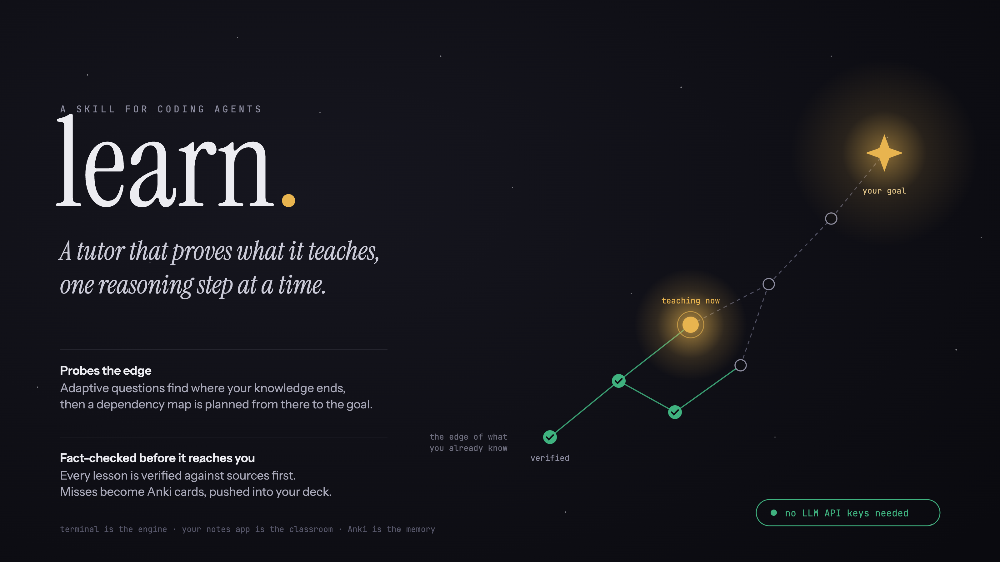
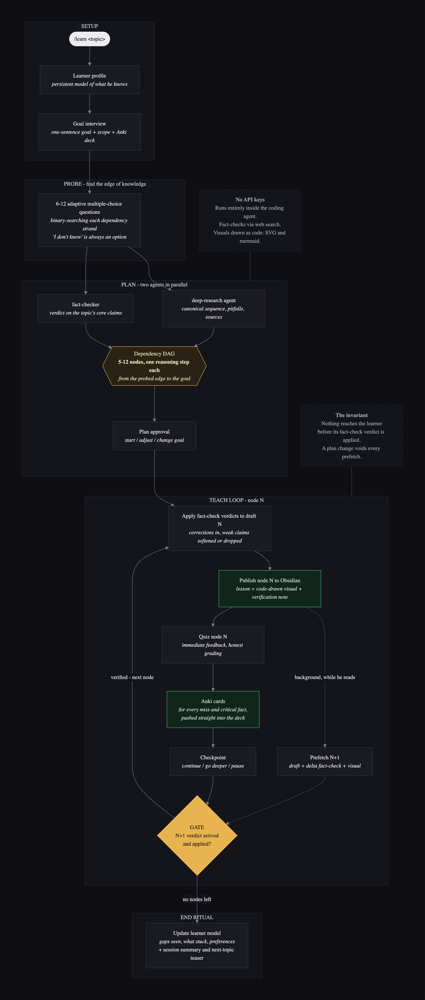

# learn.

**A tutor that proves what it teaches, one reasoning step at a time.**



A personal tutoring skill for Claude Code.
It probes the edge of what you know, plans a dependency map from there to your goal, and teaches one reasoning step at a time.
Every lesson is fact-checked against sources before you see it.
Misses become Anki cards, pushed straight into your deck.

No API keys are required.
Fact-checks run through the agent's own web search.
Visuals are drawn as code (SVG and mermaid) and visually self-verified before delivery.
Optionally, setting an `OPENAI_API_KEY` environment variable unlocks AI-generated anatomical illustrations.
Everything else works identically without it.

## How it works



The mermaid source of this diagram lives in [`assets/learn-skill.mmd`](assets/learn-skill.mmd).

## Repository layout

```
skills/learn/SKILL.md              the skill (flow, rules, failure ladder)
skills/learn/references/formats.md every template + the Anki card format
skills/learn/scripts/anki_add.py   pushes cards into Anki via AnkiConnect (local, no key)
skills/learn/scripts/gen_image.py  optional AI illustrations (only used when OPENAI_API_KEY is set)
agents/fact-checker.md             verifies claims against web sources, returns verdicts
agents/viz-maker.md                draws and self-checks one visual per lesson node
agents/deep-research-agent.md      plan-phase research (sequence, pitfalls, sources)
assets/                            cover, flow diagram, mermaid source
```

## Install

Clone this repository, point Claude Code at it, and say:

> Install this package by following INSTALL.md.

The agent copies the files, interviews you (vault path, language), personalizes the skill, and checks dependencies.
[`INSTALL.md`](INSTALL.md) holds the exact procedure it follows.
Then restart Claude Code and run `/learn <topic>`.

Manual alternative: copy `skills/learn/` into `~/.claude/skills/` and the `agents/` files into `~/.claude/agents/`, then do the personalization below yourself.

## Requirements

- No API keys required.
  Optional: `OPENAI_API_KEY` for AI-generated anatomical illustrations.
- `rsvg-convert` for SVG-to-PNG rendering: `brew install librsvg` on macOS, `apt install librsvg2-bin` on Linux (adjust the binary path in the files on Linux).
- Anki with the AnkiConnect add-on, for automatic card push.
  Without it, cards still land in a `.txt` file you can drag into Anki.
- An Obsidian vault (or any markdown folder) as the reading surface.

## Personalize before first use

Open `skills/learn/SKILL.md` and adjust three things (the agent-driven install does this for you):

1. **Vault path.** The `Paths:` line ships with a placeholder.
   Point it at your own vault or any folder.
2. **Reindex hook (R6).** The rule is conditional.
   It only applies if your vault has its own reindex script.
3. **Language (R7).** Lessons default to PT-BR.
   Change the rule to your language and keep the short-sentence discipline.

## Design notes

- Terminal is the engine.
  Your notes app is the classroom.
  Anki is the memory.
- The gate invariant: no content reaches the learner before its fact-check verdict is applied.
- Latency is hidden by prefetch: while you answer the quiz for node N, node N+1 is already being drafted, verified, and illustrated in the background.

## License

MIT.
