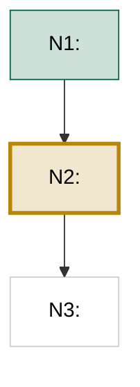

# /learn formats and templates

All learner-facing content is PT-BR. These templates are the exact shapes the skill writes.
Vault root: the vault configured in SKILL.md. Learn root: `<vault>/learn/`.

## Slug rule

Lowercase ASCII, hyphens, accents stripped, no spaces. "Insuficiência Cardíaca" → `insuficiencia-cardiaca`.

## session.md template

```markdown
---
topic: <human-readable topic>
goal: <one-sentence goal in PT-BR>
deck: Learn::<MacroTópico>   # broad area (Cardiologia, Estatística, IA), never the slug
status: probing        # probing | planning | teaching | done
node_order: []         # e.g. [N1, N2, N3, N4, N5]
current_node: null     # e.g. N3
started: YYYY-MM-DD
last_session: YYYY-MM-DD
---

# <topic>

> [!info] Objetivo
> <goal, 1-2 sentences>

## Sondagem

| # | Conceito testado | Resultado |
|---|---|---|
| 1 | <conceito> | ✅ / ❌ / 🤷 |

Borda mapeada: <2-3 sentences: what he already holds, where the edge is>.

## Plano

<one paragraph: approach and why this route, given the probed edge>



> [!check]- Afirmações centrais verificadas (ledger)
> `N confirmadas, M corrigidas, K incertas` na verificação inicial.
> - <only corrected/uncertain claims listed, each with source link>

## N1 — <Título do nó>

<node content: motivação → formalização → exemplo. LaTeX in $...$ / $$...$$.>

![[<asset-filename>]]

> [!check]- Verificação: X afirmações, Y confirmadas, Z corrigidas
> - <corrected claim> → <fix>. Fonte: <url>
> - <uncertain claim>: evidência limitada. Fonte mais próxima: <url>

**Quiz:** 1. ✅ <conceito> · 2. ❌ <conceito> (→ 2 cartões Anki) · 3. 🤷 <conceito>
```

Rules for the file:
- The mermaid `class` lines are WRITE-ONLY display, regenerated from frontmatter `node_order` + `current_node` on every advance. Never parse mermaid to recover state. Never touch node/edge lines when updating classes.
- One `## Nx — Título` section per taught node, appended in order.
- Detours (mid-lesson questions) get one italic line at the end of the current node's section: `*Desvio: <pergunta> → <1-line answer or pointer>.*`

## learner-model.md template (seeded)

Path: `learn/_profile/learner-model.md`.

```markdown
---
anki_basic: Basic
anki_cloze: Cloze
anki_deck_prefix: Learn
updated: YYYY-MM-DD
---

# Learner model — Marcos Coutinho

## Background
- Médico (UFMG), Product Manager na Telepatia AI (IA em saúde).
- MBA em IA para negócios. Programação limitada: não assumir base de engenharia.
- Forte em: raciocínio clínico, produto, negócios. Aprende bem com analogias clínicas.
- Idioma: PT-BR sempre. Conteúdo médico sempre PT-BR.

## Preferências observadas
- <appended over time: pacing, question style, what makes things click>

## Mapa de bordas por tópico
### <topic-slug> (YYYY-MM-DD)
- Domina: <...>
- Borda: <...>
- Equívocos vistos: <...>
- Fixou bem: <...>
```

Update cadence: only at pause or session end (the session.md quiz log is the write-ahead record).

## Anki delivery (two channels, same burst)

Cards are delivered twice in the same edit burst:

1. **Push (primary):** write a temp JSON (scratchpad) and run
   `python3 ~/.claude/skills/learn/scripts/anki_add.py add --json <tmp.json> --launch`.
   The script opens Anki if needed, creates the deck hierarchy, skips duplicates, and prints `deck=... added=N skipped=M`.
   JSON shape:

```json
{
  "deck": "Learn::Cardiologia",
  "notes": [
    {"type": "Basic", "front": "...", "back": "...", "tags": ["learn", "learn::<slug>", "node::N3"],
     "image": {"path": "/abs/path/to.png", "filename": "learn-<slug>-n3.png"}},
    {"type": "Cloze", "text": "... {{c1::...}} ...", "extra": "...", "tags": ["learn", "learn::<slug>", "node::N3"]}
  ]
}
```

   `type` uses the names from learner-model frontmatter (`anki_basic`, `anki_cloze`). Deck comes from session frontmatter `deck:` (master deck `Learn`, one subdeck per macro-topic). JSON fields are plain text (no HTML escaping; that is a .txt-file concern only).
   `image` is optional: AnkiConnect copies the file into the media collection and injects `` into Back (Basic) or Back Extra (Cloze) by default; pass `"fields": ["Front"]` only for identification cards ("o que é isto?"). PNG only for mobile compatibility: render the node's SVG first (`/opt/homebrew/bin/rsvg-convert -o out.png in.svg`); AI-generated images are already PNG. Filename must be unique and stable: `learn-<slug>-<node>-<n>.png`.

2. **Record (fallback):** append the same cards to `learn/anki/<topic-slug>.txt` in the import format below. This file is the durable record in the vault. If the push fails, Marcos drags this file into Anki; re-import is duplicate-safe. Cards with images: put `<br>-<node>-<n>.png">` in the same field in the .txt line. The `` resolves only if the media reached Anki via a push (file import never copies media); a fully offline session degrades to text-only cards on import, which is acceptable.

## Anki .txt import format (verified against the Anki manual)

Path: `learn/anki/<topic-slug>.txt`. UTF-8, append-only, one file per topic, 5 tab-separated columns.
File starts with these headers exactly once (write them when creating the file):

```
#separator:tab
#html:true
#notetype column:1
#deck column:2
#tags column:5
```

Then one line per note:

```
Basic	Learn::<Topic>	<Front>	<Back>	learn learn::<topic-slug> node::<node-id>
Cloze	Learn::<Topic>	<Text with {{c1::...}}>	<Back Extra>	learn learn::<topic-slug> node::<node-id>
```

Column 1 uses the names from learner-model frontmatter (`anki_basic`, `anki_cloze`).
Why this exact shape:
- `#notetype column:1` lets Basic and Cloze mix in one file (columns 3-4 map to each notetype's first two fields).
- The deck COLUMN creates missing decks. The `#deck:` header does not. Never use the header for the deck.
- Re-importing the whole file is safe: Anki matches on first field per notetype, updates in place, preserves scheduling. New lines become new cards.

Field escaping (html:true): `<` → `&lt;`, `>` → `&gt;`, `&` → `&amp;`. Line breaks inside a field: `<br>`. Never a raw tab inside a field. Never start a field with a double quote.
Tags: space-separated, hierarchy with `::`, no spaces inside a tag.

### Card quality rules
- One fact per card. Atomic.
- Cloze for definitions, numbers, doses, thresholds. Mostly a single `{{c1::...}}`. Use c1/c2 only for tightly coupled pairs (dose + frequency).
- Basic for mechanism and why questions.
- Attach an image whenever it adds recall value: anatomy, geometry, flows, curves, traçados (ECG), spatial relations. Usually the node's own visual. Never decorative images, and never an image that gives away a cloze answer.
- Image placement: answer side by default (Back / Back Extra). Front only for identification cards.
- Medical cards always PT-BR. Clinical terms verbatim, never simplified.
- Doses always carry unit, route, frequency, and population qualifier.
- Cards may only encode content that passed that node's fact-check.
- Cards are exempt from the 23-word STE sentence cap. Precision beats style.

### When to generate cards
- Quiz miss (❌) or "Não sei" (🤷): 1-3 cards on the missed concept.
- Node flagged critical (doses, load-bearing definitions, thresholds): 1-3 cards even if the quiz was clean.
- Never a blocking step: push + record in the same edit burst as the quiz log.

## Verification callout format

Per node, collapsed by default:

```markdown
> [!check]- Verificação: 7 afirmações, 6 confirmadas, 1 corrigida
> - "<claim as drafted>" → <corrected fact>. Fonte: <url>
> - "<uncertain claim>": evidência limitada. Fonte mais próxima: <url>
```

Confirmed claims appear only in the count. Corrections and uncertainties are the part worth reading.
Failure banner (non-medical only, user opted in): `> [!warning] NÃO VERIFICADO — falha de verificação nesta sessão.`
Visual failure note: `> [!note]- Visual indisponível nesta sessão.`
